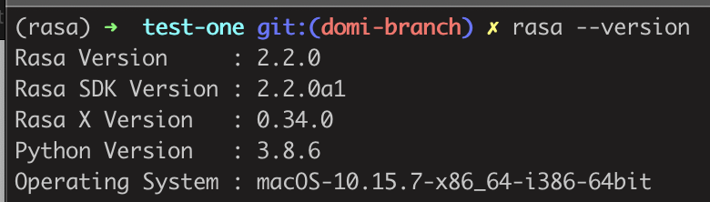
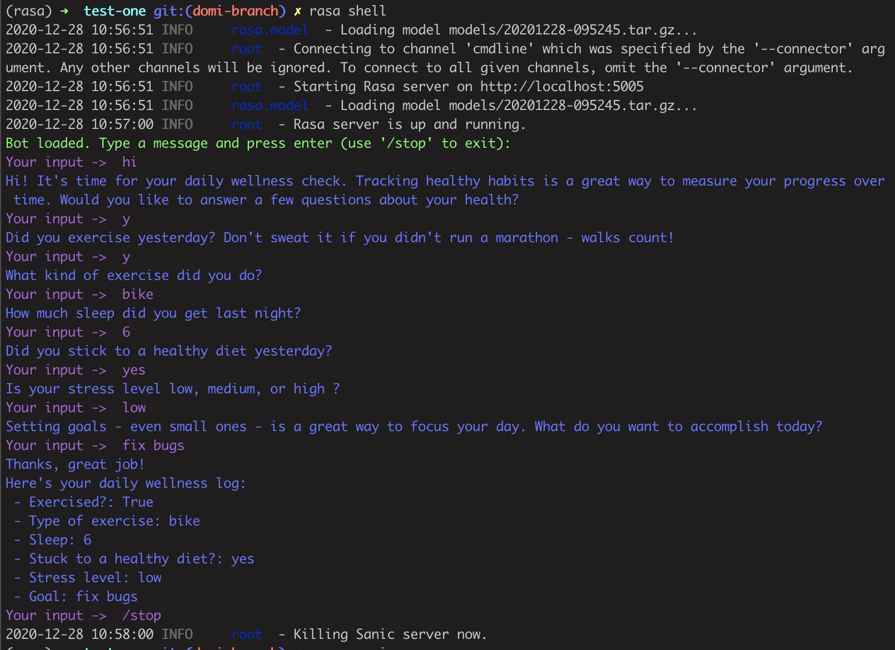

## Test bot
Test Bot made from the wellness check example to test the Integrated Version Control. 

More information on [Udemy Course - Rasa for Beginners](https://www.udemy.com/course/rasa-for-beginners/)

### Rasa version
The syntax in stories and domain yaml files was adapted so it runs with the following Rasa versions :


### TESTING
- Making master branch with a wrong Rasa layout on purpose to test IVC
- Correct Rasa layout is on "test-branch"

### Run
Once inside the project folder:
- Open two terminal windows and on the first one give the command :
```rasa run actions```

- On the second terminal, give the command :
```rasa shell```
  



